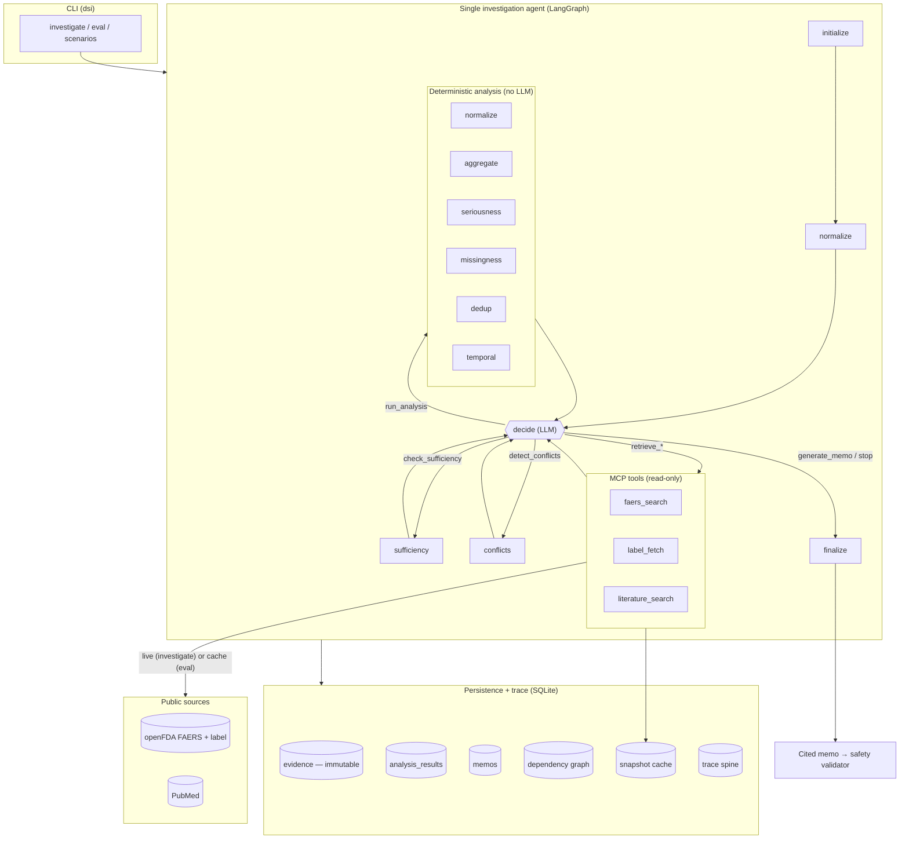

# Architecture

## One-glance view

Everything the agent does flows through the **trace spine** (tokens/latency/outcome
per tool + model call) and is persisted to SQLite. Evidence is stored **immutable**
(DB triggers); analysis and memo are separate categories that record the evidence
they consumed, so the whole thing is auditable and selectively recomputable.

## The three data categories (kept physically separate)

| Category | Where | Who may write it |
|---|---|---|
| (a) raw evidence | `domain/evidence.py`, `evidence` table | tools only; immutable after write |
| (b) deterministic analysis | `domain/analysis.py`, `analysis_results` | plain Python, never the LLM |
| (c) LLM prose (memo) | `domain/memo.py`, `memos` | the agent; rebuildable from (a)+(b) |

## Agentic vs. deterministic (the §10 answer)

The LLM is used in exactly two roles; everything numeric or safety-critical is
plain, tested Python.

| Action | Layer | Why |
|---|---|---|
| Choose the next action from state | **LLM** (agentic) | open-ended judgement over investigation state |
| Write one framing sentence | **LLM** (agentic) | non-factual narrative; validated + fallback |
| Which actions are *legal* next | Deterministic | bounds the agent; guarantees termination |
| Normalize drug/event | Deterministic | table-driven, reproducible |
| Count serious cases / missingness | Deterministic | exact arithmetic; LLMs miscount |
| Dedup / version resolution | Deterministic | precise identity logic; confirmed vs. likely |
| Temporal comparison | Deterministic | counts only, never rates |
| Conflict detection | Deterministic | preserves positions; no forced consensus |
| Sufficiency check | Deterministic | rules, not judgement |
| Safety validation of the memo | Deterministic | prohibited-pattern scan; fails the run |
| Structured-output validation | Deterministic | Pydantic + bounded re-ask + fallback |

## Selective recompute (dependency graph)

`evidence → analysis → memo_section` is modelled as a per-run DAG. Each analysis and
memo section records the content/output hashes it consumed. When evidence changes,
only downstream nodes whose inputs actually changed are recomputed; if a recomputed
analysis produces an unchanged output, the cascade **short-circuits** and its memo
sections are reused. Prior runs are preserved under a new `run_id` (audit trail).
See `persistence/depgraph.py` and Scenario A.

## Control, safety, and cost properties

- **Bounded & terminating:** step limit + token budget guards force safe termination.
- **Failure-tolerant:** tool failures are structured values (not exceptions); bounded
  retries with backoff (429/503 honor `Retry-After`); empty results are valid.
- **Untrusted input:** retrieved text enters the model only inside delimited DATA
  blocks; the system prompt marks it untrusted.
- **Context control:** the decision prompt sees only compact state summaries; the
  memo framing sees only the top-N most serious cases.
- **Reproducible:** the eval runs fully offline from a pinned snapshot cache.
